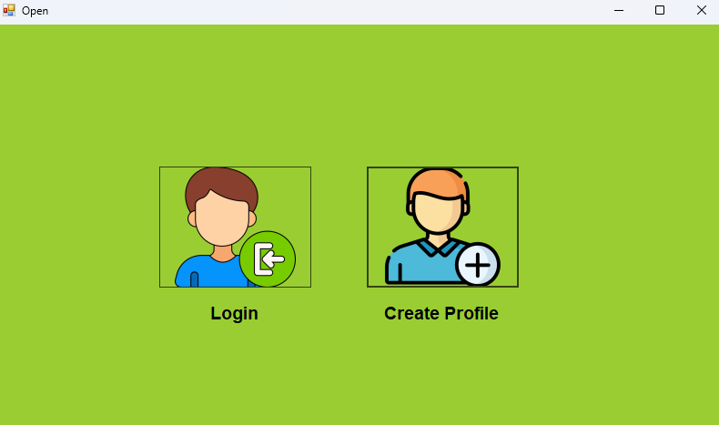
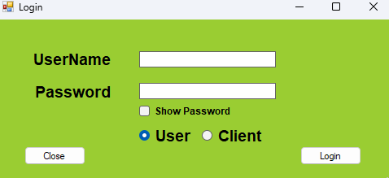
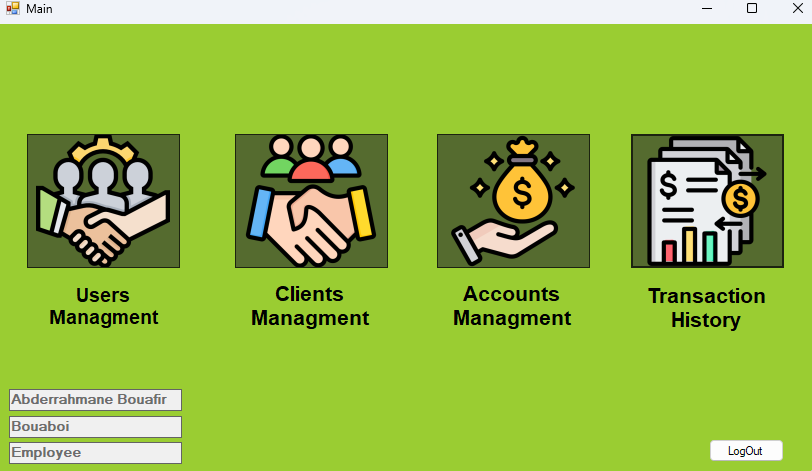
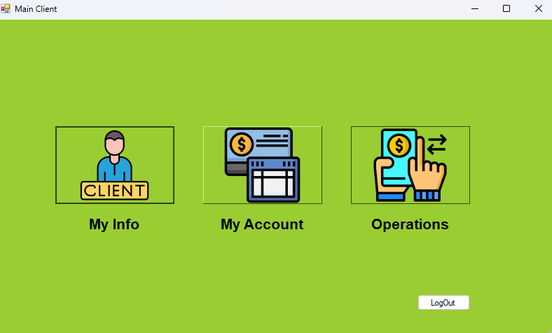

# SecureBank

## 📌 System Overview

The system is based on a database-first architecture, where the majority of business logic (such as balance verification and constraints) has been moved to SQL Server using Stored Procedures (T-SQL). This reduces the load on the client application (Windows Forms) and increases system stability.

## ⚙️ Key Features

The system is divided into two separate environments:

### 1. Employee Interface (Admin/Employee Interface)
Dedicated to system management and operations monitoring, including:
* Secure employee login
* Employee Management: View current employees and add new ones
* Customer Management: View personal information of registered customers
* Account Management: View customer bank accounts and their status
* Financial Monitoring: View complete transaction history within the bank

### 2. Customer Interface (Customer Interface)
Dedicated to end-users for managing their finances, including:
* Registration: Customers can create a new personal account and register as a customer
* Customer login
* Profile Management: View and edit personal information
* Bank Account Management: View account details and modify PIN code
* Financial Operations:
  * Deposit funds (top up account)
  * Withdraw funds
  * Transfer funds to other customer accounts
* Account Management: Customers can permanently delete their personal and bank accounts from the system

## 🛠️ Technologies Used

* **C#**
* **Windows Forms** (for UI design)
* **SQL Server** (for database design)
* **T-SQL** (for building Stored Procedures and internal logic)
* **ADO.NET** (for connecting the application to the database)

## 📸 Project Screenshots

### 1. Entry Point & Authentication
The system starts with a clear entry point allowing users to log in or create a new profile. The login system distinguishes between administrative users and bank clients.

| Welcome Screen | Login Interface |
| :---: | :---: |
|  |  |

---

### 2. User Interfaces
The project features two distinct dashboards with specific permissions and functionalities for each role.

#### 👔 Employee Dashboard (Admin)
Allows staff to manage the entire banking ecosystem, including users, clients, and global transaction monitoring.


#### 👤 Client Dashboard
A personal space for customers to manage their own info, accounts, and perform financial operations like transfers and deposits.



## 📥 How to Use This Project

### 1. Clone or Download
```bash
git clone https://github.com/bouaboi/SecureBank.git
```
Or download as ZIP from GitHub.

### 2. Set Up Database
1. Open SQL Server Management Studio
2. Open file: `Database/DatabaseScript.sql`
3. Execute the script (F5)
4. Database `BankSysDB` will be created

### 3. Configure Connection
1. Open project in Visual Studio
2. Go to: `SecureBank.DataAccess/clsDataAccessSettings.cs`
3. Update connection string:
```csharp
   public static string ConnectionString = 
       "Server=YOUR_SERVER;Database=BankSysDB;Integrated Security=true;";
```

### 4. Run
1. Open `SecureBank.sln`
2. Build → Rebuild Solution
3. Press F5 to run

### Default Admin Login
- Username: `Bouaboi`
- Password: `1234`

### Default Client Login
- Username: `Client1`
- Password: `1234`